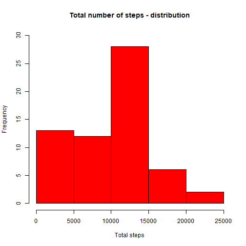
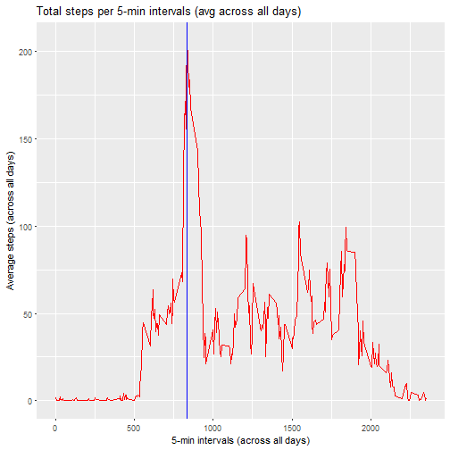
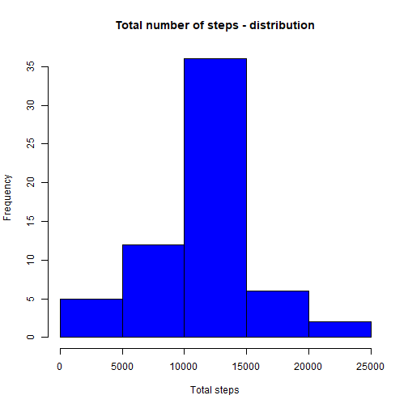
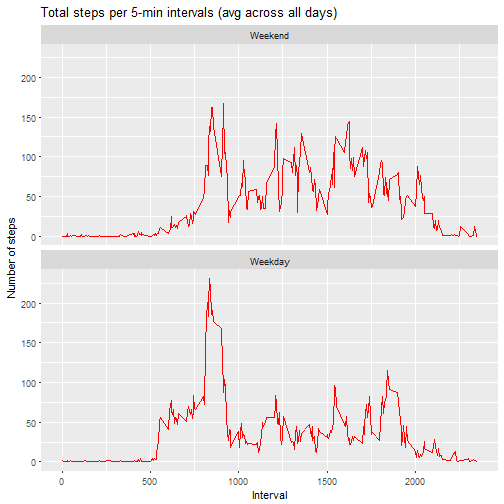

# Reproducible Research Course Project 1

*This is the submission required by the Reproducible Research course (week 2) from Coursera.*

__From the assignment's instructions:__ 

*"This assignment makes use of data from a personal activity monitoring device. This device collects data at 5-minute intervals throughout the day. The data consists of two months of data from an anonymous individual collected during the months of October and November 2012, and include the number of steps taken in 5-minute intervals each day."*

__The report will be divided in sections as follows:__

1. Loading and preprocessing the data
2. What is the mean total number of steps taken per day?
3. What is the average daily activity pattern?
4. Imputing missing values
5. Are there differences in activity patterns between weekdays and weekends?

*Firstly, global options will be set:*

```r
knitr::opts_chunk$set(echo = TRUE, results = "asis", message = FALSE)
# This ensures that code chunks and results will be shown (and message prompts will be hidden) unless otherwise specified.
```

#_______
#### 1. Loading and preprocessing the data


```r
# Create directory (if not created)
if(!file.exists("./CourseProject1/activity.csv")) {
        dir.create("CourseProject1")
}
# Download zip file (if not downloaded)
if(!file.exists("./CourseProject1/ActivityMonitorData.zip")) {
   fileURL <- "https://d396qusza40orc.cloudfront.net/repdata%2Fdata%2Factivity.zip"
   download.file(fileURL, destfile = "./CourseProject1/ActivityMonitorData.zip")        
}
# Unzip file (if not unzipped)
if(!file.exists("./CourseProject1/activity.csv")) {
        unzip("./CourseProject1/ActivityMonitorData.zip", exdir = "./CourseProject1")
}
# Read activity data into R
activitydata <- read.csv("./CourseProject1/activity.csv", na.strings = "NA" )

# Pre-processing of $date (convert from 'factor' to 'date' format)
library(dplyr)
activitydata<- dplyr::mutate(activitydata, date = as.Date(date))
```

#_______
#### 2. What is the mean total number of steps taken per day?


```r
# Calculating the total number of steps per day 
library(dplyr)
activitydata_byday <- activitydata %>% 
                      group_by(date) %>%
                      summarize(totalsteps = sum(steps, na.rm = TRUE)) 

# Plotting histogram
hist(activitydata_byday$totalsteps
    , main = "Total number of steps - distribution"
    , xlab = "Total steps"
    , col = "red"
    , ylim = c(0,30)
    )
```



```r
# Mean of total number of steps taken per day
mean(activitydata_byday$totalsteps)
```

[1] 9354.23

```r
# Median of total number of steps taken per day
median(activitydata_byday$totalsteps)
```

[1] 10395

#_______
#### 3. What is the average daily activity pattern?


```r
# Summarizing total steps per 5-min interval (average across all days)
library(dplyr)
activitydata_byinterval <- activitydata %>% 
        group_by(interval) %>%
        summarize(avg_steps = mean(steps, na.rm = TRUE))

# Plotting time-series
library(ggplot2)
ggplot(activitydata_byinterval, aes(x=interval,y=avg_steps)) +
        ggtitle("Total steps per 5-min intervals (avg across all days)") +
        geom_line(color = "red") +
        geom_vline(xintercept = 835 , color = "blue") +
        xlab("5-min intervals (across all days)") +
        ylab("Average steps (across all days)")
```



```r
# 5-min interval with the maximum number of steps       
descIntervals <- arrange(activitydata_byinterval, desc(avg_steps))
maxInterval <- as.data.frame(descIntervals[1,])
maxInterval[1,1]
```

[1] 835

#_______
#### 4. Imputting missing values

__In order to input missing values, the following operations will be performed:__

1. Obtain average steps per 5-min interval (across all days)
2. Create auxiliary dataframe by performing inner join of the step 1 dataframe with the original dataframe. This will provide an average for each row. 
3. When an NA value is present, replace it with the average (in new dataframe)


```r
# Calculating the total number of missing values in the dataset
sum(is.na(activitydata))
```

[1] 2304

```r
# Filling missing values
library(dplyr)
activitydata_byinterval <- activitydata %>% 
        group_by(interval) %>%
        summarize(avg_steps = mean(steps, na.rm = TRUE)) # This dataframe gives avg steps per 5-min interval

# An inner join provides an additional column with average steps for all 5-min intervals (for all rows)
activitydata <- inner_join(activitydata,activitydata_byinterval, by = "interval")

# Will use the additional column to substitute NA values (and keep non-NAs)
activitydataComplete <- activitydata %>% 
                        mutate(steps = ifelse(is.na(steps) == TRUE,avg_steps,steps)) %>%
                        select(steps,date,interval)

# The dataframe activitydataComplete contains the original data, plus all NA values replaced with average steps (for 5-min intervals across all days)

# Histogram
activitydataComplete_byday <- activitydataComplete %>% 
                      group_by(date) %>%
                      summarize(totalsteps = sum(steps)) 

# Plotting histogram of total steps per day
hist(activitydataComplete_byday$totalsteps
    , main = "Total number of steps - distribution"
    , xlab = "Total steps"
    , col = "blue"
    )
```



```r
# Mean of total number of steps taken per day
mean(activitydataComplete_byday$totalsteps)
```

[1] 10766.19

```r
# Median of total number of steps taken per day
median(activitydataComplete_byday$totalsteps)
```

[1] 10766.19

The values presented after adjusting for NA values differ from those in the first section of the report (i.e. histogram, mean, and median, without accounting for NAs). Namely:
- Mean and median are higher (and also equal) in the second instance
- Histogram now more closely resembles a Normal Distribution 


#_______
#### 5. Differences in activity patterns between weekdays and weekends? 


```r
# Add 'weekday' variable to dataframe
library(dplyr)
activitydata_daytype <- activitydataComplete %>%
                        mutate(weekday = as.factor(weekdays(date))) %>%
                        mutate(daytype = ifelse(weekday %in% c("Saturday","Sunday"),"Weekend" ,"Weekday")) %>%
                        mutate(daytype = as.factor(daytype))

# Panel plot of time-series for both weekdays and weekends
# ==========================================================

# First create the summaries for weekdays and weekends separately
activitydataWeekdays_byinterval <- activitydata_daytype %>%
                                filter(daytype == "Weekday") %>%
                                group_by(interval) %>%
                                summarize(avg_steps = mean(steps)) %>%
                                mutate(daytype = "Weekday")

activitydataWeekends_byinterval <- activitydata_daytype %>%
                                filter(daytype == "Weekend") %>%
                                group_by(interval) %>%
                                summarize(avg_steps = mean(steps)) %>%
                                mutate(daytype = "Weekend")

# Row-bind the summaries and prepare a faceted plotting
activitydatadaytype_byinterval <- rbind(activitydataWeekends_byinterval,activitydataWeekdays_byinterval)
activitydatadaytype_byinterval <- activitydatadaytype_byinterval %>%
                                mutate(daytype = as.factor(daytype)) # (converted $daytype to factor for using the facets in ggplot)
activitydatadaytype_byinterval$daytype <- factor(activitydatadaytype_byinterval$daytype, levels = c("Weekend","Weekday")) # (simply reordered levels so that facets are in the proper order)


library(ggplot2)
ggplot(activitydatadaytype_byinterval, aes(x=interval,y=avg_steps)) +
        ggtitle("Total steps per 5-min intervals (avg across all days)") +
        geom_line(color = "red") +
        facet_wrap(~daytype, nrow = 2, ncol = 1) +
        xlab("Interval") +
        ylab("Number of steps")
```




~ Report presented by student Guillermo Pereira, Nov 4th, 2018.
